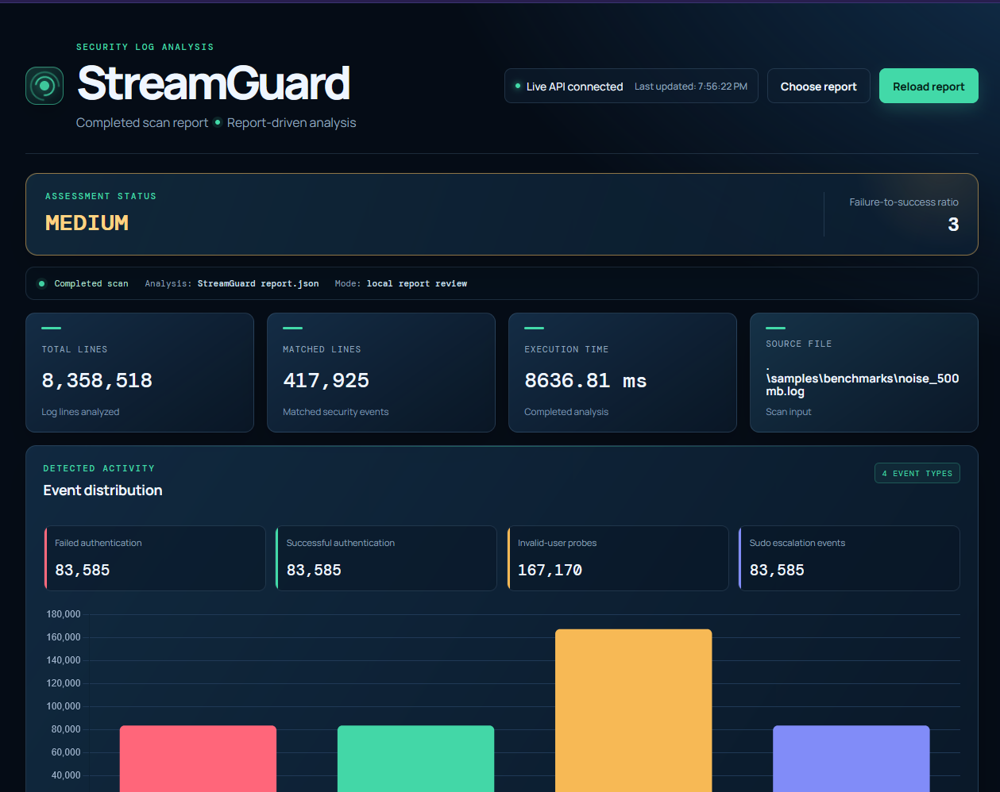
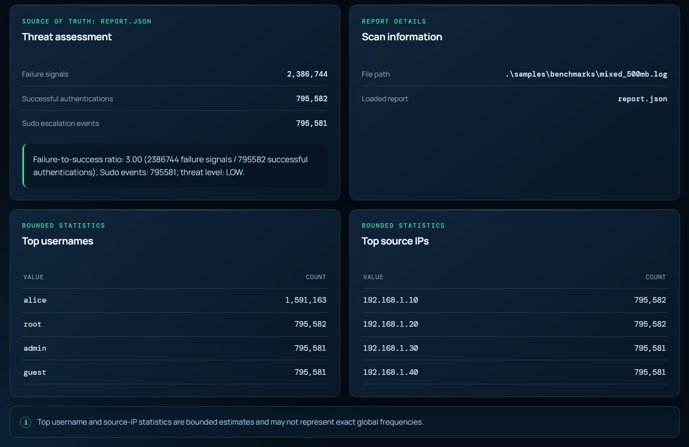

# StreamGuard

> A bounded-memory, single-threaded security log analyzer built with C# and .NET 10.

## Overview

StreamGuard processes security log files sequentially, one line at a time, rather than loading the entire file into memory.

The project's primary engineering challenge is processing multi-gigabyte input without allowing memory usage to grow with the total file size.

## Why StreamGuard?

Traditional whole-file approaches require memory proportional to input size. StreamGuard processes input incrementally, retaining only the bounded state needed for analysis. The project experimentally evaluates whether this design keeps observed process memory approximately stable while processing multi-gigabyte security logs.

## Key Features

- Sequential streaming with `StreamReader.ReadLineAsync()`.
- Security-event detection for supported syslog `auth.log` formats.
- Failed authentication detection.
- Successful authentication detection.
- Both supported invalid-user probe formats.
- Sudo/privilege-escalation event detection.
- Timestamp, username, and source-IP extraction.
- Bounded statistics (event, username, and IP).
- Explainable LOW/MEDIUM/HIGH threat assessment.
- JSON report generation using `System.Text.Json`.
- Experimental performance and memory validation.

## Architecture

```text
Log File
   │
   ▼
LogScanner
   │
   ▼
SecurityEventParser
   │
   ├── Event Counts
   ├── Username/IP Bounded Statistics
   │
   ▼
ThreatAssessment
   │
   ▼
ReportGenerator
   │
   ▼
report.json
   │
   ▼
Dashboard
```

## Technology Stack

- C#
- .NET 10 console application
- ASP.NET Core Web API (Minimal APIs)
- `StreamReader`
- `ReadLineAsync()`
- `System.Text.RegularExpressions`
- `System.Text.Json`
- xUnit

## Getting Started

### Prerequisites

- .NET 10 SDK

### Build

```text
dotnet build -c Release
```

### Test

```text
dotnet test StreamGuard.slnx
```

The current test suite contains 41 tests, all passing.

## Usage

### 1. Run the Analyzer

```text
dotnet run --project src/StreamGuard -- <path-to-log>
```

Example:

```text
dotnet run --project src/StreamGuard -- samples/sample.log
```

Use `--output <path>` to choose a different report path (the dashboard expects `report.json` in the root by default):

```text
dotnet run --project src/StreamGuard -- samples/sample.log --output report.json
```

### 2. Run the Dashboard

```text
dotnet run --project src/StreamGuard.Api
```

Then open `http://localhost:5000/dashboard/` in your browser.

## Output

```text
File scanned: samples/sample.log
Lines processed: 7
Matched lines: 6
Event counts: FailedAuthentication=2, SuccessfulAuthentication=1, InvalidUserProbe=2, SudoEscalation=1
Top usernames: alice (3), bob (1), guest (1), root (1)
Top source IPs: 192.168.1.10 (3), 192.168.1.20 (1), 192.168.1.50 (1)
Threat level: MEDIUM (ratio: 4.00)
Threat explanation: Failure-to-success ratio: 4.00 (4 failure signals / 1 successful authentications); Sudo escalation events: 1; threat level: MEDIUM.
Report written: report.json
Execution time: 00:00:00.0720570
```

## Core Components

| Component                    | Responsibility                                                                                                    |
| ---------------------------- | ----------------------------------------------------------------------------------------------------------------- |
| `Program.cs`                 | CLI entry point, argument parsing, output formatting                                                              |
| `LogScanner.cs`              | Streaming line-by-line processing, line/match counting, event aggregation, and coordination of bounded statistics |
| `SecurityEventParser.cs`     | Regex-based security event detection and field extraction                                                         |
| `BoundedFrequencyCounter.cs` | Bounded username and source-IP statistics with capacity enforcement                                               |
| `ThreatAssessment.cs`        | Failure-to-success ratio heuristic, threat level classification                                                   |
| `ReportGenerator.cs`         | JSON report serialization using `System.Text.Json`                                                                |

## Security Analysis

StreamGuard detects the following event types from syslog `auth.log` format:

- **Failed authentication** — failed password attempts for valid users
- **Successful authentication** — accepted password logins
- **Invalid-user probes** — failed attempts for non-existent users (probing)
- **Sudo escalation events** — sudo command executions

For each event, the parser extracts:

- Timestamp (preserved as raw syslog format `MMM dd HH:mm:ss`)
- Username (target account)
- Source IP address (when present in log line)

Threat assessment computes a failure-to-success ratio:

- Failed authentications + invalid-user probes = failure signals
- Successful authentications = success signals
- Ratio thresholds: `< 3` = LOW, `< 10` = MEDIUM, `>= 10` = HIGH
- Zero successful authentications with failures = HIGH; zero failures = LOW
- Sudo escalation events reported separately, do not affect ratio

This assessment is a heuristic, not a definitive security classification.

## Dashboard

The dashboard is a standalone presentation layer that consumes the generated `report.json`. It does **not** read logs, run the scanner, or perform threat analysis.

### Features

- Loads `report.json` from repository root or via **Choose report** button
- Displays threat assessment level, ratio, and explanation
- Shows event counts by type (failed, successful, invalid-user, sudo)
- Event distribution bar chart (Chart.js)
- Top usernames and source IPs tables (bounded statistics)
- Scan metadata: file path, line counts, execution time
- **Reload report** button to refresh after regenerating report

### Run Locally

The dashboard and the live report API are served together from the ASP.NET Core API project.

1. Start the ASP.NET Core API:

```powershell
dotnet run --project src/StreamGuard.Api
```

2. Open the dashboard in your browser:

`http://localhost:5000/dashboard/`

Generate the report at the repository root (or let the analyzer write to the default location), and the dashboard will automatically pick it up when you select **Live API**. You can also manually load any JSON report via the **Choose report** button.

### Dashboard Preview




The dashboard is presentation/report-review only. It does not perform the core log analysis.

### Live Dashboard API

The project includes an ASP.NET Core Web API to serve the latest `report.json` to the dashboard automatically, providing a live-update experience. ASP.NET Core serves both the dashboard static files and the report API, removing the need for a separate Python web server.

**Why it exists**: The API acts purely as a report delivery layer. It avoids duplicating the core log analysis logic while allowing the dashboard to poll for the latest generated report without requiring the user to manually select the file.

**Architecture**:

```text
                ASP.NET Core
                     │
          ┌──────────┴──────────┐
          │                     │
    /dashboard/             /api/report
          │                     │
    HTML/CSS/JS              report.json
          │                     │
          └──────────┬──────────┘
                     ▼
                  Browser
```

The dashboard will automatically attempt to connect to the Live API and poll every 5 seconds. If the API is offline or unreachable, the dashboard safely falls back and allows manual report selection. Because the dashboard and API share the same origin, CORS is not required.
## Performance & Memory Validation

### Methodology

The benchmark used Release builds, one warm-up run per dataset, and three measured runs per dataset. Throughput was calculated as file size in MiB divided by application-reported execution time. Process working set was measured externally at 50 ms intervals and compared with `PeakWorkingSet64`.

### Environment

| Property      | Value                         |
| ------------- | ----------------------------- |
| .NET          | 10.0.302                      |
| OS            | Windows 11                    |
| CPU           | 12th Gen Intel Core i5-12450H |
| RAM           | Approximately 16 GB           |
| Storage       | Fixed NTFS                    |
| Configuration | Release                       |

### Benchmark Scope

Two workloads were tested:

- **Mixed authentication workload**: 10 MiB, 100 MiB, 500 MiB, 1 GiB, and approximately 1.65 GiB.
- **Noise-heavy workload**: 100 MiB, 500 MiB, and 1 GiB, with approximately 95% unrelated lines and 5% representative supported security events.

### Results

| Dataset            |     Size | Mean Time | Mean Throughput | Peak Working Set |
| ------------------ | -------: | --------: | --------------: | ---------------: |
| `mixed_10mb.log`   |   10 MiB |  1.0586 s |      9.45 MiB/s |        46.34 MiB |
| `mixed_100mb.log`  |  100 MiB |  3.5052 s |     28.53 MiB/s |        48.73 MiB |
| `mixed_500mb.log`  |  500 MiB | 12.8075 s |     39.04 MiB/s |        46.12 MiB |
| `mixed_1gb.log`    |    1 GiB | 25.5368 s |     40.11 MiB/s |        48.89 MiB |
| `massive_auth.log` | 1.65 GiB | 42.1203 s |     40.18 MiB/s |        44.79 MiB |

### Findings

Larger mixed inputs reached approximately 39–40 MiB/s. Small inputs had lower throughput, consistent with greater relative startup overhead. Peak working set remained approximately 44–50 MiB for the larger tested inputs, and input size increased substantially without a proportional increase in observed process working set.

Noise-heavy inputs showed higher observed throughput, but the workloads also differ in the proportion of matching security events. This demonstrates workload behavior rather than isolating the effect of noise percentage alone.

This is not a mathematical O(1) memory proof. Working set is not equivalent to managed heap size; runtime buffering, OS/filesystem behavior, sampling limits, background activity, and individual line size can affect the measurement.

For the complete methodology, individual runs, limitations, and detailed analysis, see [Benchmark Summary](benchmarks/benchmark_summary.md).

Raw measurements are available in [Benchmark Results](benchmarks/benchmark_results.csv).

### Reproducing the Benchmark

The deterministic benchmark datasets can be generated with:

```powershell
powershell -ExecutionPolicy Bypass -File .\tools\Generate-BenchmarkLogs.ps1
```

The generator creates datasets under `samples/benchmarks/`. These large generated inputs are excluded from version control; the generator itself is committed for reproducibility.

## Sample Data

| File                       | Description                                                                     |
| -------------------------- | ------------------------------------------------------------------------------- |
| `samples/sample.log`       | 7-line sample log demonstrating supported event formats                         |
| `samples/report.json`      | Example JSON report generated from sample.log                                   |
| `samples/benchmarks/`      | Generated benchmark datasets (mixed and noise-heavy workloads, 100 MiB – 1 GiB) |
| `samples/massive_auth.log` | ~1.65 GB auth log for large-scale testing                                       |

All generated benchmark inputs in `samples/benchmarks/` are excluded from version control; the generator script is committed for reproducibility.

## Project Structure

```text
StreamGuard/
├── assets/                         # Project-level documentation images
│   ├── Screenshot1.png
│   └── Screenshot2.png
│
├── benchmarks/                     # Benchmark artifacts
│   ├── benchmark_results.csv       # Raw measurements (24 runs)
│   └── benchmark_summary.md        # Detailed analysis
│
├── dashboard/                      # Web-based report viewer
│   ├── index.html
│   ├── app.js
│   ├── style.css
│   ├── professional.css
│   └── technical.css
│
├── samples/                        # Example and benchmark inputs
│   ├── sample.log                  # 7-line sample
│   ├── report.json                 # Sample output report
│   ├── massive_auth.log            # ~1.65 GB auth log
│   └── benchmarks/                 # Generated benchmark inputs (gitignored)
│
├── src/
│   ├── StreamGuard/                # Console application
│   │   ├── Program.cs
│   │   ├── LogScanner.cs
│   │   ├── SecurityEvent.cs
│   │   ├── SecurityEventParser.cs
│   │   ├── ThreatAssessment.cs
│   │   ├── ReportGenerator.cs
│   │   └── BoundedFrequencyCounter.cs
│   └── StreamGuard.Api/            # Live Dashboard API
│       ├── Program.cs
│       └── appsettings.json
│
├── tests/                          # xUnit tests
│   └── StreamGuard.Tests/
│
├── tools/
│   └── Generate-BenchmarkLogs.ps1
│
├── README.md
├── StreamGuard.slnx
└── .gitignore
```

## Testing

```text
dotnet test StreamGuard.slnx
```

Current test suite: **41 passed, 0 failed, 0 skipped**.

Tests cover:

- Line counting (empty file, trailing newline handling)
- Security event parsing (all 4 event types, username/IP extraction, timestamps)
- Malformed/unrelated line rejection
- Bounded frequency counter capacity enforcement and eviction
- Scan integration (matched line counting)

## Limitations

- Supported parsing is limited to documented syslog `auth.log` formats.
- Threat assessment is a heuristic, not a definitive security classification.
- Bounded top-user/IP results are approximate after eviction.
- Benchmark results depend on hardware, OS, storage, runtime, and workload.
- Working-set measurements are not equivalent to managed heap measurements.
- The benchmark does not prove mathematical O(1) memory.
- Individual line size can affect memory usage.

## Project Status

**Phase 5 — Performance and Memory Validation: COMPLETE**

Implemented:

- Streaming log processing with `StreamReader.ReadLineAsync()`
- Security event parsing for 4 event types
- Bounded statistics (username/IP counters with capacity 100)
- Threat assessment with LOW/MEDIUM/HIGH levels
- JSON report generation (`System.Text.Json`)
- Dashboard for report review
- Formal benchmark with throughput and memory measurements

No further implementation phases are currently planned.
